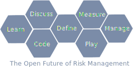

## Welcome to the Open Risk! 👋

## About our Github Repositories 

This collection of open source risk tools and risk models supports our overall mission. 

- For the big picture, commentary and many other resources check our [blog](https://www.openriskmanagement.com/)
- 💬 [Discussion at the Open Risk Commons](https://www.openriskcommons.org/)
- For knowledge base, consult the [Open Risk Manual](https://www.openriskmanual.org/wiki/Main_Page)
- 🌱 For training, head to the [Open Risk Academy](https://www.openriskacademy.com/) 
- For [live demos](https://www.openriskmanagement.com/dashboard)
- For (experimental) [Open Risk Data](https://www.openriskmanual.org/data/index.php/Main_Page)

There are many more tools 🔭 coming so check frequently :-)